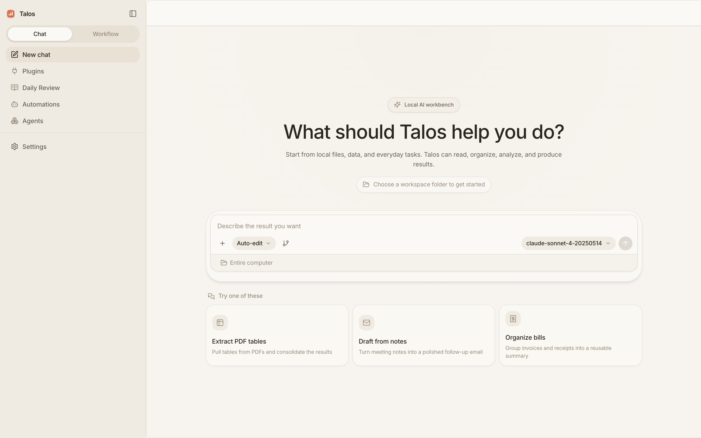

# Talos

<p align="center">
  <a href="README.zh-CN.md"></a>
  <a href="https://github.com/yyf9664-del/Talos/actions/workflows/ci.yml"></a>
  <a href="https://github.com/yyf9664-del/Talos/stargazers"></a>
  <a href="https://github.com/yyf9664-del/Talos/blob/main/LICENSE"></a>
  
  
</p>

<p align="center">
  
</p>

<h3 align="center">A local-first AI agent that runs on your own computer.</h3>

<p align="center">
  Runs on your machine, works with your local files, prefers local models, and connects to the cloud only when you choose to.
</p>

---

## Why Talos

- **No account.** Install and start working—no login, billing, seats, or recharge flows.
- **Your data stays local.** Files, conversations, memory, and generated results live on your device.
- **Works with your real files.** Word, Excel, PPT, PDF, CSV—turn them into briefs, tables, plans, and emails.
- **One thread, end to end.** Go from analysis to planning to a follow-up email without restating context.
- **Pick your own model.** Run local models via [Rapid-MLX](https://github.com/raullenchai/Rapid-MLX) or [Ollama](https://ollama.com), or bring your own API key (OpenAI, Anthropic, Google, and more) when you need the cloud.
- **Use it from your phone.** Enable remote access, scan a QR code, and send tasks to your computer.

## What It Can Do

| You ask it to | You get |
|---------------|---------|
| Read a long document | Key takeaways, risks, owners, next steps, and a send-ready email |
| Analyze a spreadsheet | Budget variance, anomalies, and meeting-ready talking points |
| Review a slide deck | Slide-by-slide story, evidence gaps, and speaker notes |
| Synthesize several files | One complete brief that reconciles all of them |
| Split work in parallel | Multiple sub-tasks running at once, aggregated in the main thread |
| Continue in one thread | Action plans, agendas, and follow-up drafts without repeating context |

## Project Status

> Talos is currently **in development** and does not ship a packaged installer yet. You can clone and run it from source to try the full experience; packaged releases will come in a later version.

## Quick Start

Run from source (see [For Developers](#for-developers) below):

```bash
git clone https://github.com/yyf9664-del/Talos.git
cd Talos
npm install
npm run dev:all
```

Once it's running:

1. Choose a model: local Rapid-MLX / Ollama, or bring your own cloud provider API key.
2. Start a new conversation and upload a real file.
3. Say what you want—a brief, plan, email, or table.
4. Review the result and keep iterating in the same thread.

## Model Options

**Local first**

- **Rapid-MLX:** Apple Silicon Macs can start and switch MLX models from Settings.
- **Ollama:** Run any local model via [Ollama](https://ollama.com)—auto-detected and usable offline.
- **Custom local endpoint:** Point Talos at your own OpenAI-compatible server.

**Optional cloud providers (bring your own API key)**

OpenRouter, OpenAI, Anthropic, Google, DeepSeek, Groq, Mistral, xAI, Qwen, Kimi, MiniMax, Zhipu, plus an existing ChatGPT subscription.

Cloud is optional. Talos provides no hosted accounts and proxies no traffic—requests go directly from your computer to the provider you configure.

## For Developers

**Tech stack:** Tauri v2, Rust, Next.js 15, FastAPI, SQLite

```text
desktop-tauri/    Rust desktop shell and system integration
frontend/         Next.js chat UI, settings, artifacts, streaming
backend/          FastAPI agent engine, tool execution, model streaming, storage
```

`npm run dev:all` starts the backend (port `8000`) and frontend (port `3000`). For more, see [frontend/README.md](frontend/README.md) and [backend/README.md](backend/README.md).

## FAQ

<details>
<summary>Does my data leave my machine?</summary>

Files, conversations, memory, and generated results are stored locally. With local models nothing leaves your machine; only when you pick a cloud model is content sent directly to the provider you configured.
</details>

<details>
<summary>Do I need an account?</summary>

No. Talos has no account, login, or recharge flow. Cloud providers only require your own API key or subscription.
</details>

<details>
<summary>How is it different from ChatGPT or Claude.ai?</summary>

Talos runs on your desktop and is built around local files, tools, permissions, and continuous workflows—more of a local workbench that can read files and use tools than a web chat box.
</details>

<details>
<summary>Can I use it offline?</summary>

Yes. Download a model with Rapid-MLX (Apple Silicon Mac) or Ollama, and you can use Talos without any cloud calls.
</details>

<details>
<summary>How does remote access work?</summary>

Enable remote access in settings and scan the QR code to use the mobile web client. It connects over Cloudflare Tunnel with token-based auth—no port forwarding needed.
</details>

## Community & License

- Questions & discussion: [GitHub Discussions](https://github.com/yyf9664-del/Talos/discussions)
- Bug reports: [GitHub Issues](https://github.com/yyf9664-del/Talos/issues)
- Contributing: [CONTRIBUTING.md](CONTRIBUTING.md)
- License: [Apache-2.0](LICENSE)
