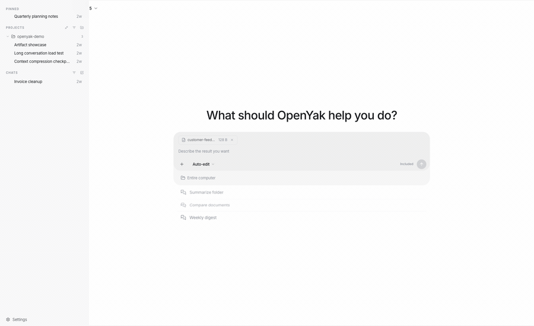
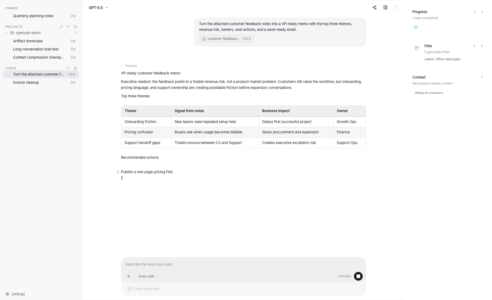
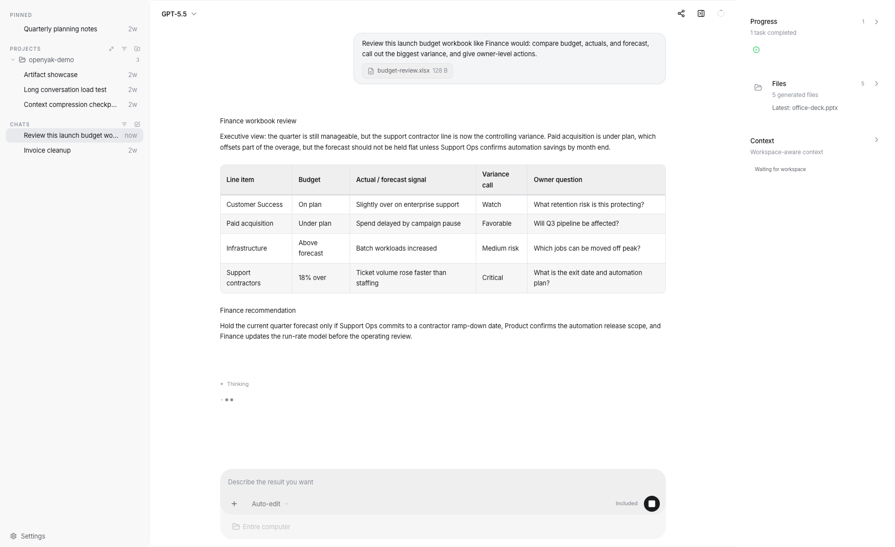
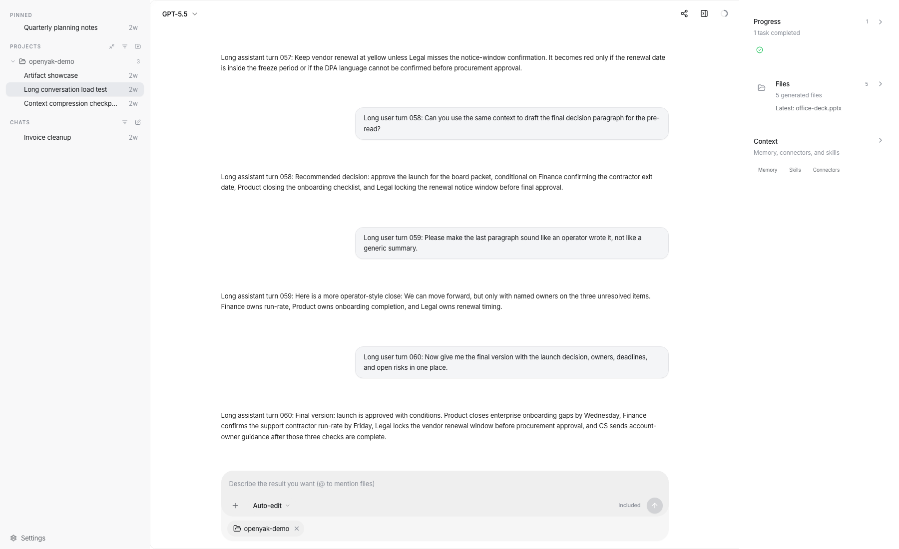

# OpenYak

<p align="center">
  <a href="README.md"></a>
  <a href="https://github.com/openyak/openyak/actions/workflows/ci.yml"></a>
  <a href="https://github.com/openyak/openyak/stargazers"></a>
  <a href="https://github.com/openyak/openyak/blob/main/LICENSE"></a>
  <a href="https://github.com/openyak/openyak/releases/latest"></a>
  
  <a href="https://github.com/openyak/openyak/pulls"></a>
</p>

<p align="center">
  
</p>

<h3 align="center">面向文件、工具、长线程和真实桌面工作的本地优先 AI Agent。</h3>

<p align="center">
  在自己的电脑上运行 agent，处理本地文件，优先使用本地模型，只在你主动选择时连接云端模型提供商。
</p>

---

## 为什么选择 OpenYak

OpenYak 不是另一个必须登录的云端工作区，而是一个运行在你电脑上的本地 AI agent。

- **不需要 OpenYak 账号。** 安装应用，选择本地模型或自带 provider key，就可以开始工作；没有登录、账单、席位或充值流程。
- **本地优先的 agent runtime。** 文件、对话、记忆、生成的 artifact、工具权限和工作流状态都留在你的设备上。
- **直接处理真实文件。** 上传 DOCX、XLSX、PPTX、PDF、CSV 和本地项目上下文，生成 brief、表格、follow-up、计划和可复用 artifact。
- **同一个线程走完整流程。** 先分析文件，再继续生成 RACI、follow-up 邮件、会议 agenda，不需要反复重讲背景。
- **自由选择模型边界。** 通过 [Rapid-MLX](https://github.com/raullenchai/Rapid-MLX) 或 [Ollama](https://ollama.com) 本地运行模型；需要云端模型时，再使用自己的 OpenRouter、OpenAI、Anthropic、Google 等 provider key。
- **从其他设备访问桌面 agent。** 开启远程访问后扫码连接，通过安全 tunnel 把任务发给你的电脑执行。

## 它解决什么问题

| 你让 OpenYak 做什么 | 它应该交付什么 |
|---------------------|----------------|
| 阅读一份长 memo | 高管简报、风险、owner、下一步行动和可直接发送的邮件 |
| 分析一个 workbook | Budget / actual variance、驱动因素、异常和财务会议口径 |
| 审阅一份 deck | 每页叙事、证据缺口、speaker notes 和最后的 decision ask |
| 综合多份文件 | 把 memo、预算表、deck、PDF 对齐成一份 board brief |
| 拆给多个 agent 并行处理 | 多个 child-agent task、独立会话链接和汇总结果 |
| 在同一线程继续追问 | RACI、30 天计划、agenda 和 follow-up 草稿 |
| 遇到错误 | 上传、鉴权、文件解析失败时给出清楚的恢复路径 |

## 真实办公 Workflow

### 从 Memo 到高管简报

OpenYak 可以把很长的 memo 整理成给管理层、团队同步或 follow-up 邮件使用的结构化 brief。

<p align="center">
  
</p>

<p align="center">
  
</p>

### 从表格到财务口径

表格不应该只被截图摘要。你可以要求 OpenYak 分析预算差异、forecast 风险、owner 级行动项，以及可以直接拿去开会的财务口径。

<p align="center">
  
</p>

### 从多文件到 Artifact

OpenYak 可以在同一个线程里综合多份文件，并在右侧 artifact panel 打开可复用的 brief、计划、图表和结构化输出。

<p align="center">
  
</p>

### Multi-Agent Task Batch

把较大的请求拆成多个聚焦的 child-agent task，并行执行；父线程负责收拢进度、子会话链接和最终汇总结果。

<p align="center">
  
</p>

### 长对话与自动压缩

真实办公任务很少一轮结束。OpenYak 支持连续追问、修订、长线程保留上下文，让任务从分析自然推进到执行。

<p align="center">
  
</p>

<p align="center">
  
</p>

## 下载

| 平台 | 架构 | 格式 |
|------|------|------|
| macOS | Apple Silicon / Intel | `.dmg`, `.app` |
| Windows | x64 | `.exe` 安装包 |
| Linux | x64 | `.deb`, `.rpm` |

> [下载最新版本](https://github.com/openyak/openyak/releases/latest) 或访问 [open-yak.com/download](https://open-yak.com/download/)。
>
> Linux 用户可以查看 [LINUX.md](LINUX.md) 了解依赖、安装和排障说明。

## 快速开始

1. **安装 OpenYak。** 下载适合你系统的安装包。
2. **选择推理运行在哪里。** 用 Rapid-MLX / Ollama 在本地或离线运行；需要托管模型时，再连接 BYOK 云端 provider。
3. **新建会话并上传真实文件。**
4. **直接说你要的交付物。** 比如 brief、行动计划、RACI、邮件、表格或 artifact。
5. **检查结果并继续追问。** 在同一个线程里继续从分析推进到执行。

示例 prompt：

```text
请阅读我上传的文件，整理成一份给团队同步用的简洁 brief：
先列三条关键结论，再列风险、负责人和下一步行动。
最后写一封可以直接发给团队的 follow-up 邮件。
```

## 模型选项

### 本地优先

- **Rapid-MLX：** Apple Silicon macOS 用户可以在设置里启动、切换精选 MLX 模型。OpenYak 会连接 Rapid-MLX 在 `localhost` 暴露的 OpenAI-compatible API。
- **Ollama：** 通过 [Ollama](https://ollama.com) 运行任意本地模型。OpenYak 会自动检测本地模型，也可以在无网络环境下工作。
- **自定义本地 endpoint：** 如果你自己运行 OpenAI-compatible 模型服务，可以直接把 OpenYak 指向本地地址。

### 可选云端 Provider

| 提供商 | 接入方式 | 说明 |
|--------|----------|------|
| OpenRouter | BYOK | 使用自己的 OpenRouter API Key |
| OpenAI | BYOK | 使用自己的 API Key |
| Anthropic | BYOK | 使用自己的 API Key |
| Google | BYOK | Gemini 模型 |
| DeepSeek | BYOK | 直连提供商密钥 |
| Groq | BYOK | 高速托管推理 |
| Mistral | BYOK | 直连提供商密钥 |
| xAI | BYOK | Grok 模型 |
| Qwen | BYOK | 直连提供商密钥 |
| Kimi | BYOK | Moonshot 模型 |
| MiniMax | BYOK | 直连提供商密钥 |
| 智谱 | BYOK | 直连提供商密钥 |
| ChatGPT | 订阅 | 在可用时使用现有 ChatGPT Plus、Pro、Team 或 Enterprise 方案 |

云端和订阅路径都是可选项。OpenYak 不提供内置模型账号，也不代理模型流量；请求会从你的桌面端直接发往你配置的 provider。

## 核心能力

- **文件理解：** office 文档、表格、演示文稿、PDF、CSV、本地文件夹和生成的 artifact。
- **Artifact 工作区：** 可复用 Markdown brief、表格、流程图、清单和结构化输出。
- **工具执行：** 读取、写入、重命名、整理和自动化文件，并由用户控制权限。
- **长上下文任务：** 从分析到计划再到 follow-up，不需要重新开始。
- **远程访问：** 通过二维码和 Cloudflare Tunnel 从手机连接桌面端。
- **自动化任务：** 定时清理、报告、文件整理和重复工作流。
- **隐私控制：** 本地存储、无需 OpenYak 账号、BYOK provider、本地模型支持。

## 开发者

**技术栈：** Tauri v2、Rust、Next.js 15、FastAPI、SQLite

**Monorepo 结构：**

```text
desktop-tauri/    Rust 桌面外壳和系统集成
frontend/         Next.js 聊天 UI、设置、artifact、SSE 流式传输
backend/          FastAPI agent 引擎、工具执行、LLM 流式传输、存储
```

**快速启动：**

```bash
npm run dev:all
```

这会启动后端 `8000` 端口和前端 `3000` 端口。更完整的开发说明请看 [frontend/README.md](frontend/README.md) 和 [backend/README.md](backend/README.md)。

## FAQ

<details>
<summary>我的数据会离开本机吗？</summary>

文件、对话、记忆、生成的 artifact 和工作流状态都存储在本机。使用 Rapid-MLX、Ollama 或其他本地 endpoint 时，模型请求留在你的机器上。只有当你主动选择云端模型时，prompt 和相关上下文才会从桌面端直接发送给你配置的模型提供商。
</details>

<details>
<summary>需要 OpenYak 账号吗？</summary>

不需要。OpenYak 不需要账号、登录、账单资料、充值流程、团队工作区或托管 OpenYak 后端。使用云端 provider 时，你需要自己的 API Key 或已有订阅；不使用云端 provider 时，可以直接走本地模型。
</details>

<details>
<summary>和 ChatGPT 或 Claude.ai 有什么区别？</summary>

OpenYak 运行在你的桌面上，围绕本地文件、artifact、工具、权限和连续工作流设计。网页版聊天助手很适合问答，OpenYak 更像一个能查看文件、使用工具、把长任务留在你电脑上的本地 agent 工作台。
</details>

<details>
<summary>可以离线使用吗？</summary>

可以。在 Apple Silicon macOS 上，可以使用 Rapid-MLX 和已下载的 MLX 模型；在 macOS、Windows 或 Linux 上，可以安装 Ollama 并下载模型。之后 OpenYak 可以在不调用云端模型的情况下本地运行。
</details>

<details>
<summary>远程访问怎么工作？</summary>

在设置里开启远程访问，扫描二维码即可打开移动端网页。OpenYak 通过 Cloudflare Tunnel 和 token-based authentication 连接，不需要端口转发。
</details>

## 社区

- **提问与讨论：** [GitHub Discussions](https://github.com/openyak/openyak/discussions)
- **Bug 反馈：** [GitHub Issues](https://github.com/openyak/openyak/issues)
- **参与贡献：** [CONTRIBUTING.md](CONTRIBUTING.md)

## 许可证

[Apache-2.0](LICENSE)
