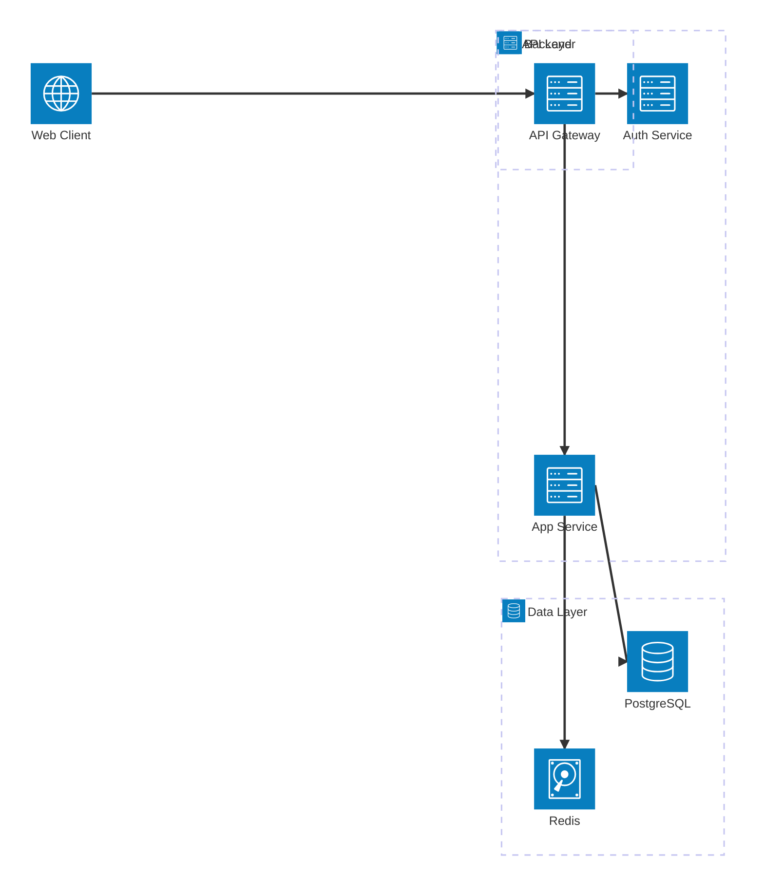
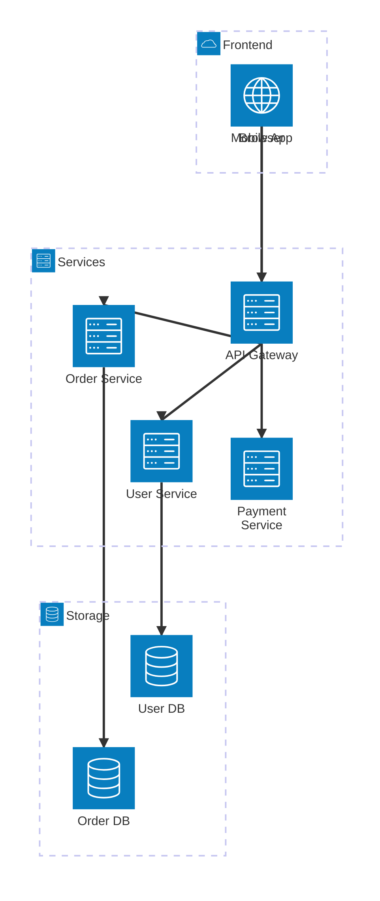

# Architecture Diagram Templates

## Basic Architecture (Beta)

## Microservices Architecture

## Key Syntax

- `architecture-beta` - Declaration keyword (beta suffix required)
- **Groups**: `group id(icon)[Label]`, nest with `in parent_id`
- **Services**: `service id(icon)[Label]`, place with `in group_id`
- **Junctions**: `junction id` - enable 4-way splits
- **Edges**: `service1:Direction --> Direction:service2`
- **Directions**: `T` (top), `B` (bottom), `L` (left), `R` (right)
- **Arrow types**: `-->` (forward), `<--` (reverse), `---` (no arrow)
- **Built-in icons**: `cloud`, `database`, `disk`, `internet`, `server`
