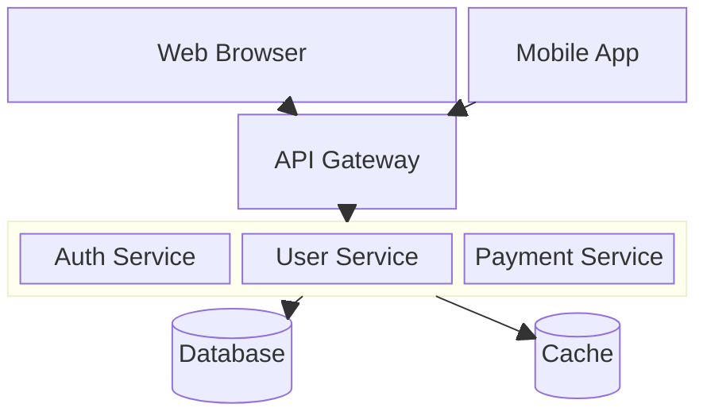
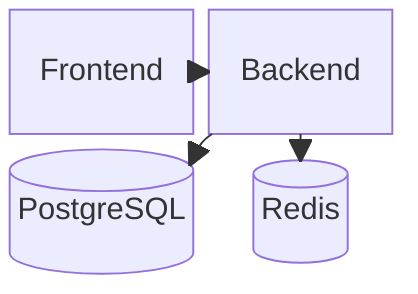

# Block Diagram Templates

## Basic Architecture

## System Overview

## Key Syntax

- `block-beta` - Declaration keyword
- `columns N` - Set number of columns
- **Shapes**: `a["label"]` square, `a("label")` round, `a[("label")]` cylinder, `a(("label"))` circle, `a{"label"}` diamond, `a{{"label"}}` hexagon
- **Spanning**: `a["label"]:N` - span N columns
- **Spacing**: `space` or `space:N` for multi-column space
- **Nested blocks**: `block:id:width ... end`
- **Links**: `a --> b`, `a --- b`, `a -->|"label"| b`
- **Styling**: `style id fill:#f9f,stroke:#333`
