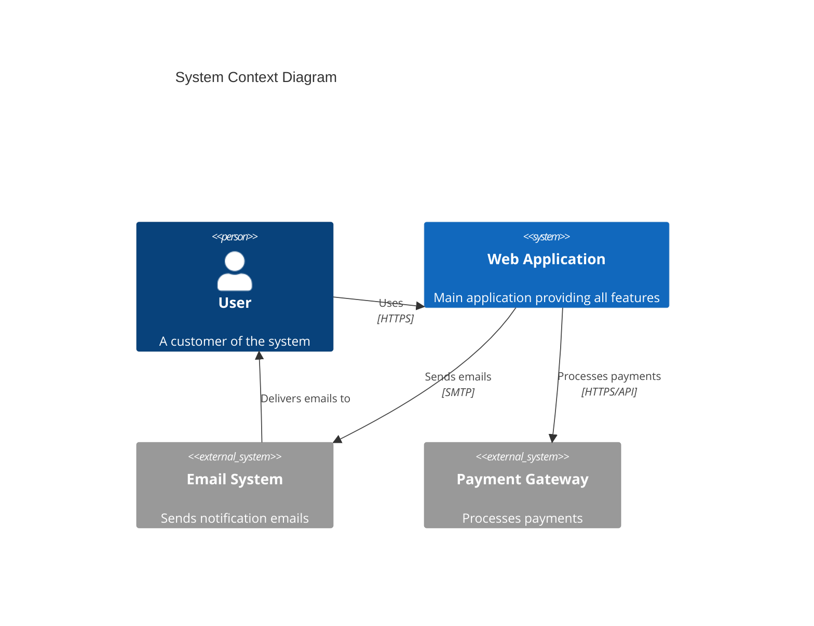
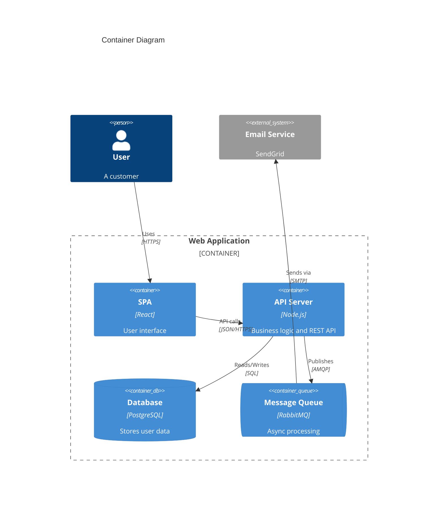
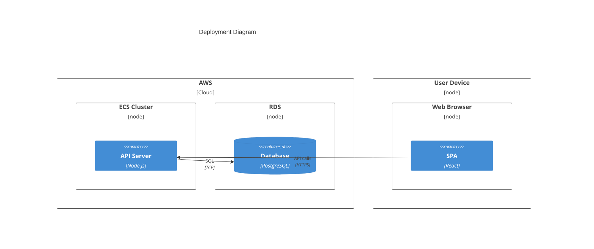

# C4 Diagram Templates

## C4 Context Diagram

## C4 Container Diagram

## C4 Deployment Diagram

## Key Syntax

- **Diagrams**: `C4Context`, `C4Container`, `C4Component`, `C4Dynamic`, `C4Deployment`
- **Nodes**: `Person(alias, label, descr)`, `System(alias, label, descr)`, `Container(alias, label, techn, descr)`, `ContainerDb(...)`, `ContainerQueue(...)`
- **External**: Add `_Ext` suffix: `System_Ext(...)`, `Container_Ext(...)`
- **Boundaries**: `Enterprise_Boundary(alias, label) { }`, `System_Boundary(...)`, `Container_Boundary(...)`
- **Relationships**: `Rel(from, to, label, techn)`, `BiRel(...)`, `Rel_U/D/L/R(...)`
- **Styling**: `UpdateElementStyle(name, $bgColor, $fontColor, $borderColor)`
