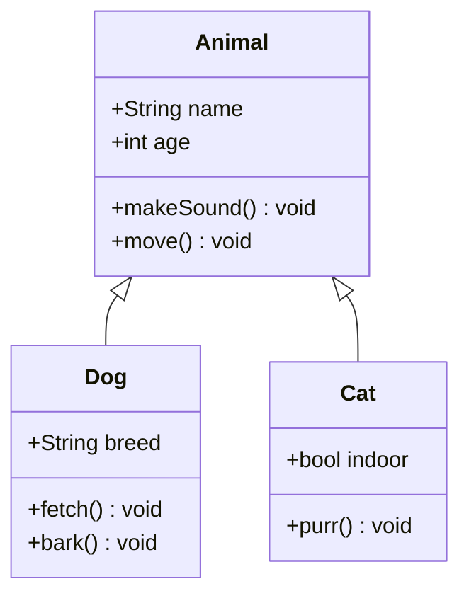
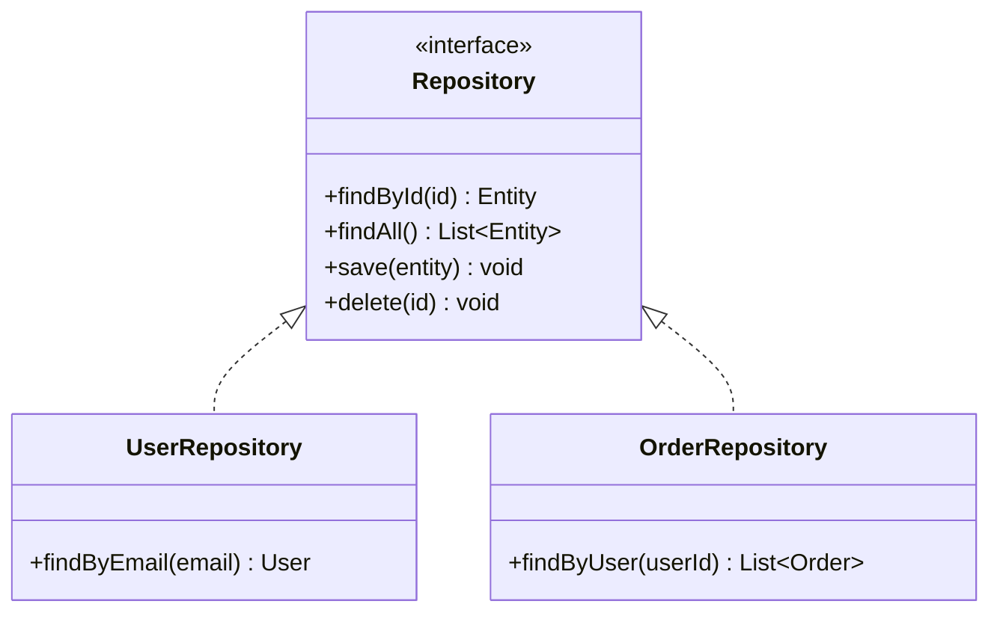
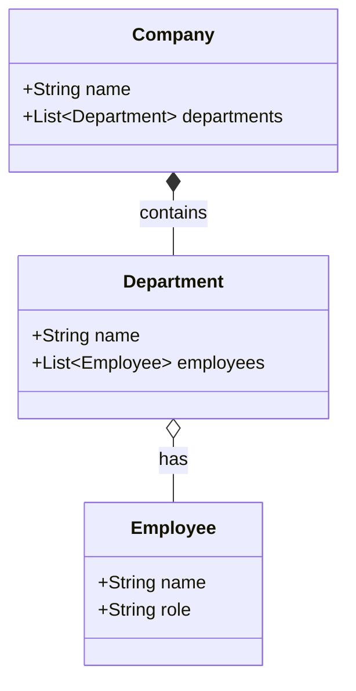

# Class Diagram Templates

## Basic Inheritance

## Interface Pattern

## Composition and Aggregation

## Relationship Types

- `<|--` Inheritance (extends)
- `<|..` Implementation (implements)
- `*--` Composition (strong ownership)
- `o--` Aggregation (weak ownership)
- `-->` Association
- `-->`  Dependency (dashed)
- `1` `*` `0..1` `1..*` Cardinality labels
