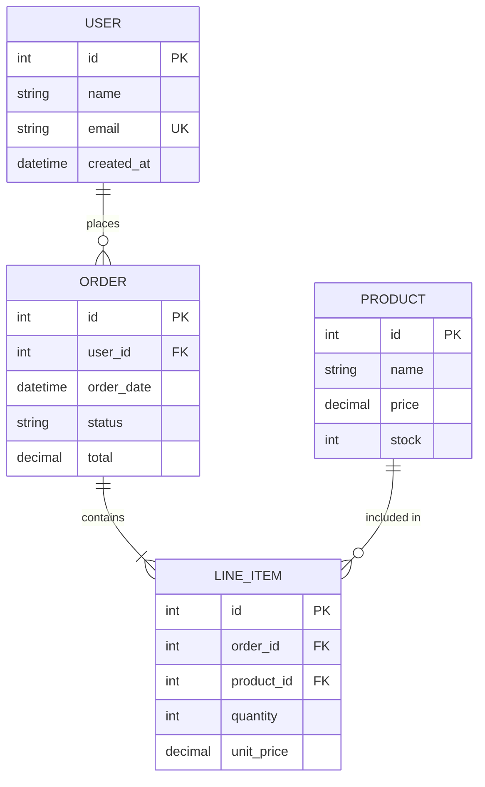
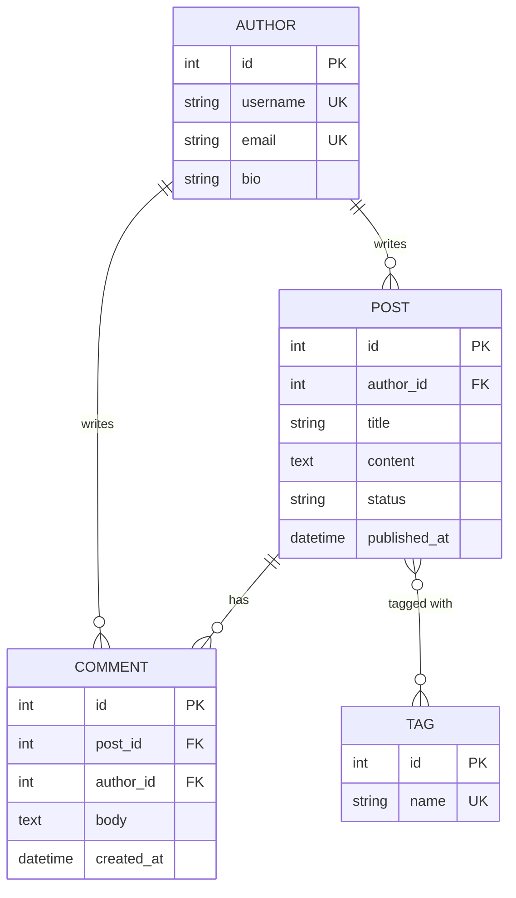

# Entity-Relationship Diagram Templates

## Basic ER Diagram

## Blog Platform Schema

## Relationship Cardinality

- `||--||` Exactly one to exactly one
- `||--o{` One to zero or many
- `||--|{` One to one or many
- `}o--o{` Zero or many to zero or many
- `}|--|{` One or many to one or many

## Attribute Labels

- `PK` Primary Key
- `FK` Foreign Key
- `UK` Unique Key
