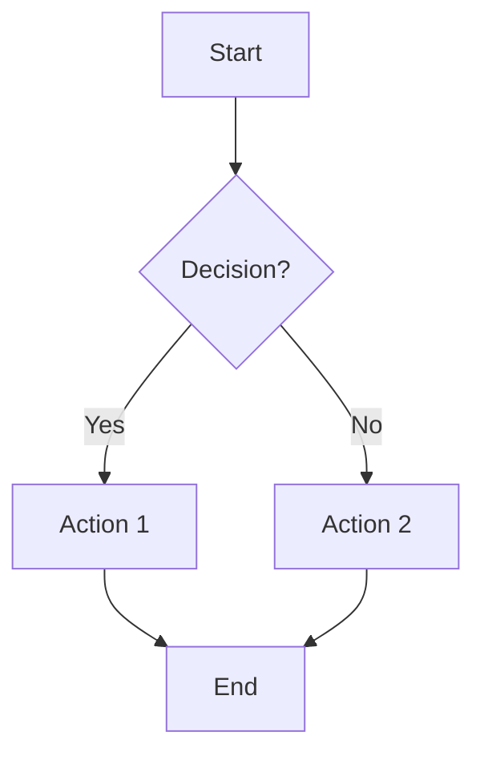
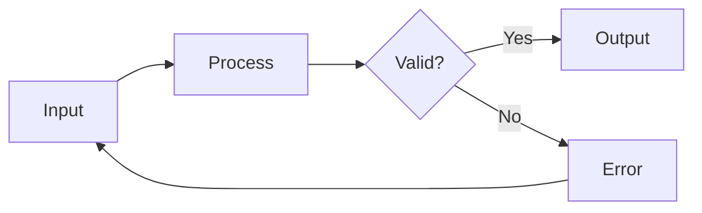
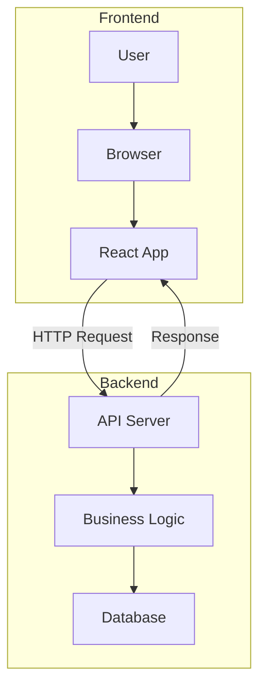
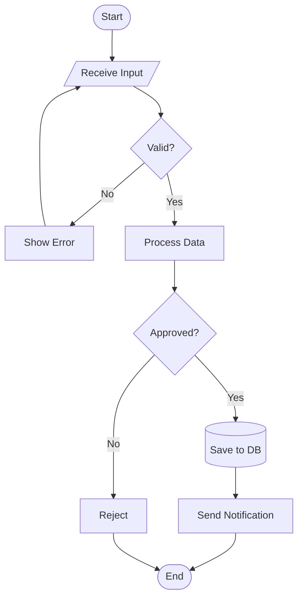

# Flowchart Templates

## Basic Top-Down Flowchart

## Left-Right Flowchart

## Flowchart with Subgraphs

## Multi-Decision Flowchart

## Node Shapes Reference

- `[Text]` - Rectangle (process)
- `{Text}` - Diamond (decision)
- `([Text])` - Stadium/pill (start/end)
- `[(Text)]` - Cylinder (database)
- `[/Text/]` - Parallelogram (input/output)
- `((Text))` - Circle
- `>Text]` - Flag
