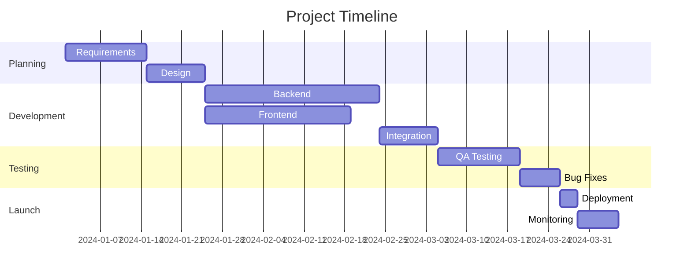
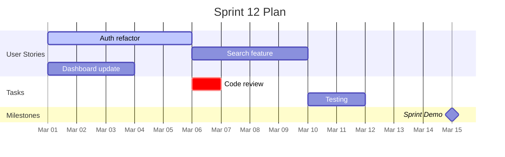

# Gantt Chart Templates

## Basic Project Timeline

## Sprint Plan

## Key Syntax

- `dateFormat YYYY-MM-DD` - Date format
- `axisFormat %b %d` - Axis display format
- `:active` - Currently active task
- `:crit` - Critical path task
- `:done` - Completed task
- `:milestone` - Milestone marker
- `after taskId` - Dependencies
- `2024-01-01, 14d` - Start date and duration
