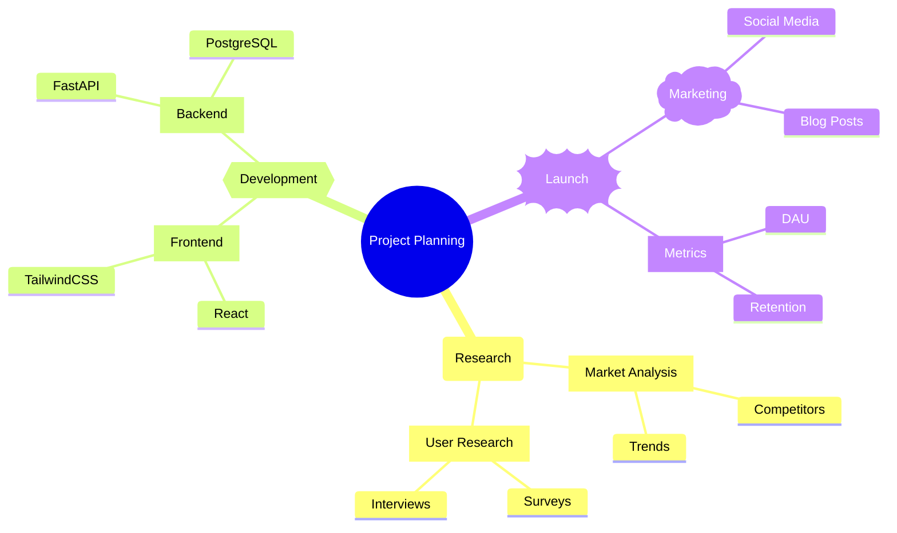
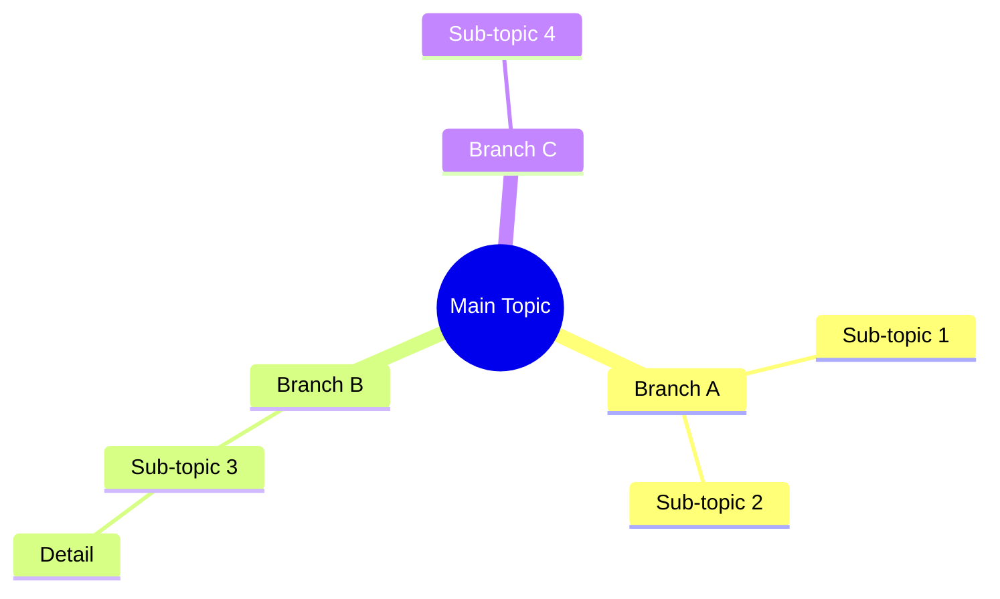

# Mindmap Templates

## Project Planning

## Basic Topic Map

## Node Shapes

- `Root text` - Default (rectangle)
- `[Square text]` - Square corners
- `(Rounded text)` - Rounded corners
- `((Circle text))` - Circle
- `))Bang text((` - Explosion/starburst
- `)Cloud text(` - Cloud
- `{{Hexagon text}}` - Hexagon

## Key Syntax

- `mindmap` - Declaration keyword
- Hierarchy determined by indentation
- First node is the root (often uses `root((Label))`)
- Supports **bold** and *italic* in node labels
- Icons: `Node::icon(fa fa-book)`
