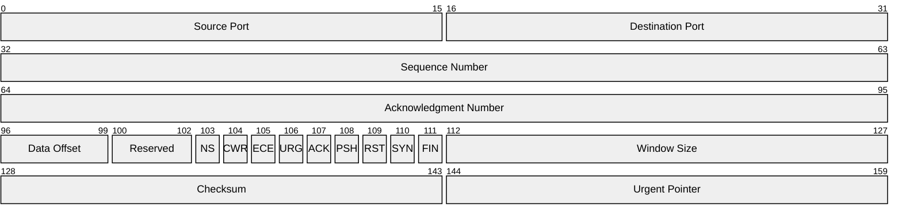
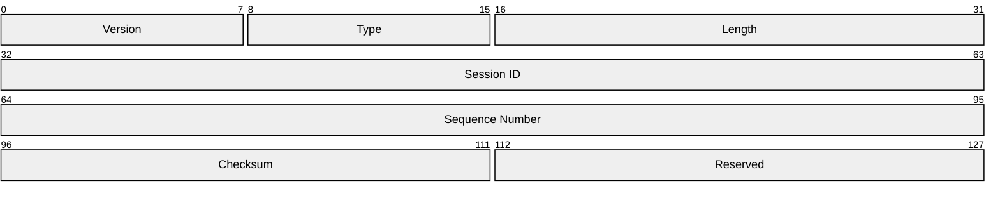

# Packet Diagram Templates

## TCP Header

## Simple Protocol (using +N syntax)

## Key Syntax

- `packet-beta` - Declaration keyword
- **Range syntax**: `0-15: "Label"` - explicit bit range
- **Auto-increment syntax**: `+16: "Label"` - spans N bits from previous end
- Both syntaxes can be mixed in one diagram
- Fields wrap to next row based on `bitsPerRow` (default 32)
- Config options: `bitsPerRow`, `showBits`, `rowHeight`, `bitWidth`
