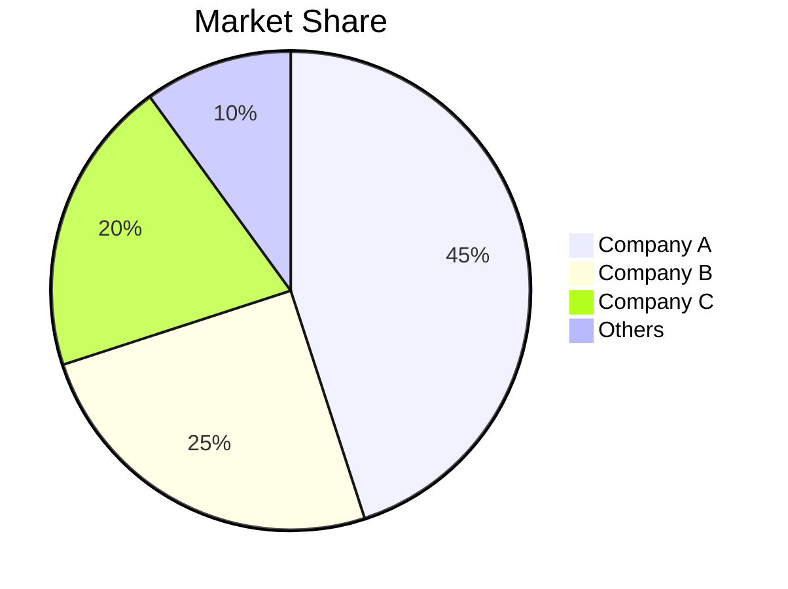
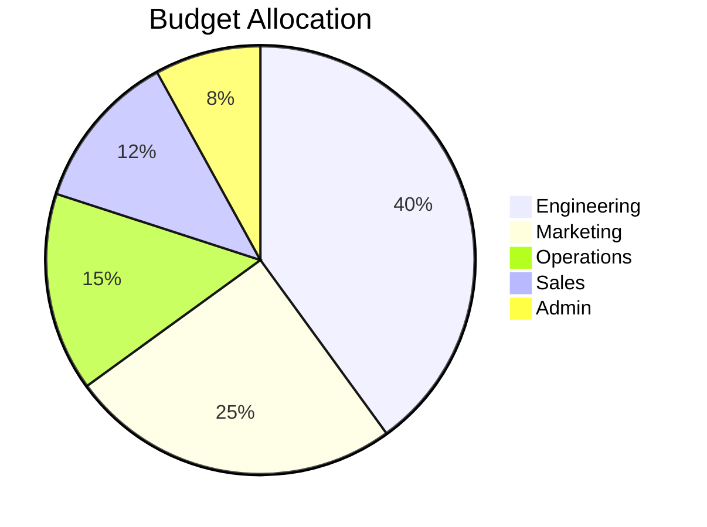
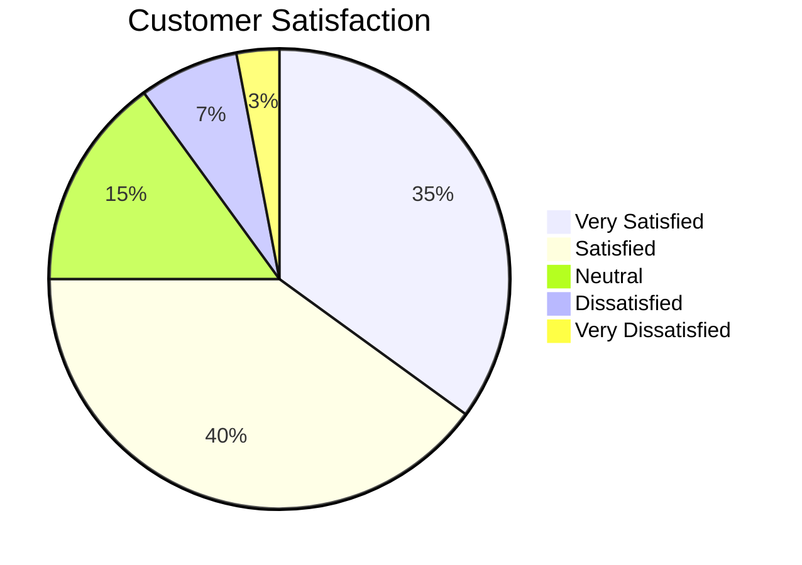

# Pie Chart Templates

## Basic Distribution

## Budget Breakdown

## Survey Results

## Key Syntax

- `pie title Title` - Chart with title
- `pie showData` - Show values on slices
- `"Label" : value` - Each slice with label and numeric value
- Values are proportional (don't need to sum to 100)
- **IMPORTANT**: For non-ASCII (Chinese, etc.) title text, use `pie title "中文标题"` with quotes
