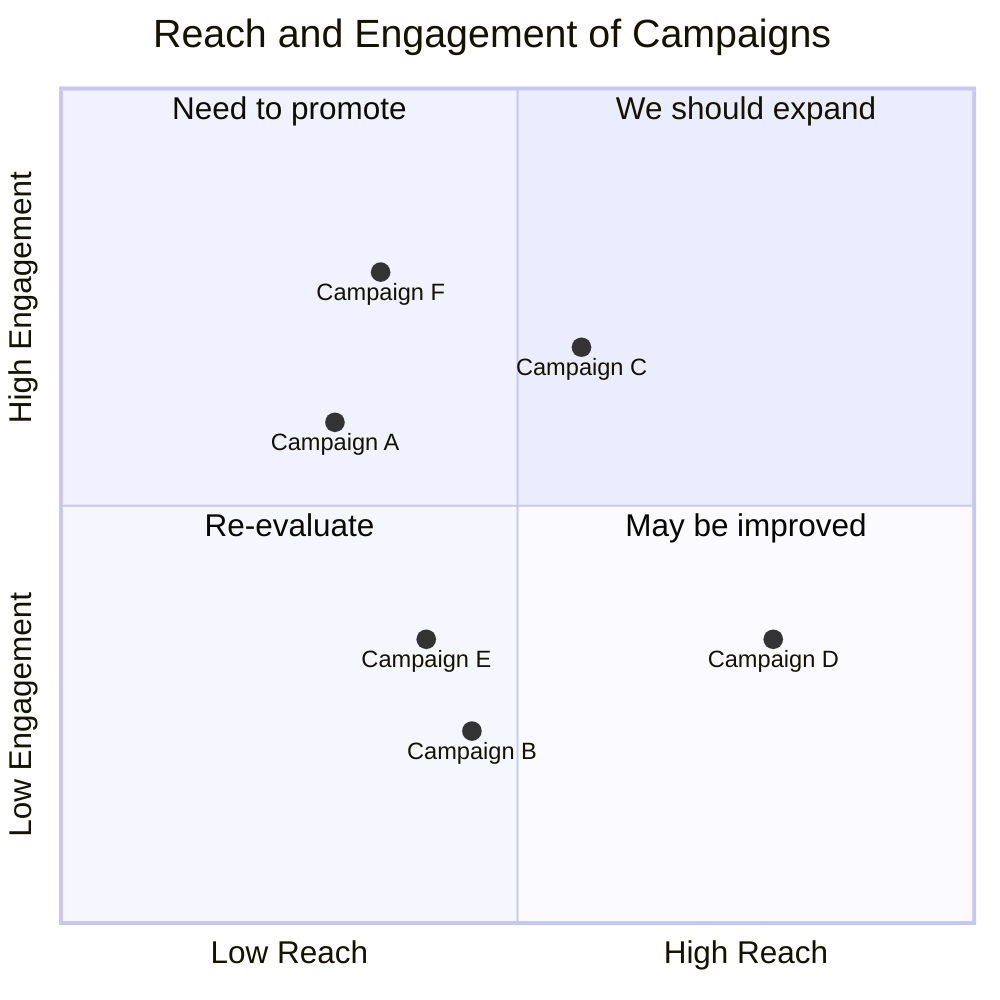
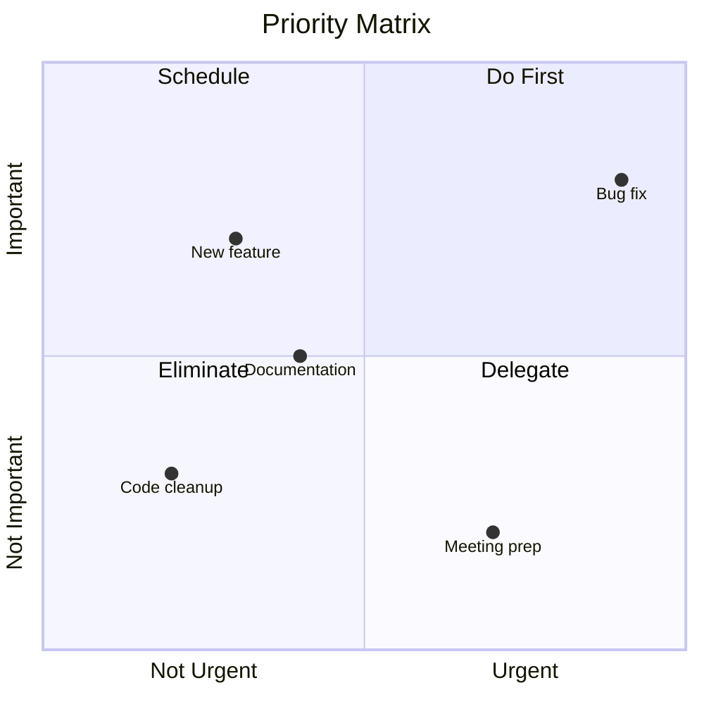

# Quadrant Chart Templates

## Basic Quadrant Chart

## Priority Matrix (Eisenhower)

## Key Syntax

- `quadrantChart` - Declaration keyword
- `x-axis Left Label --> Right Label` - Horizontal axis
- `y-axis Bottom Label --> Top Label` - Vertical axis
- `quadrant-1` through `quadrant-4` - Quadrant labels (1=top-right, 2=top-left, 3=bottom-left, 4=bottom-right)
- `Point Name: [x, y]` - Data point (x and y range from 0.0 to 1.0)
- Optional point styling: `Point: [x, y] color: #ff0000, radius: 15`
- **IMPORTANT**: For non-ASCII (Chinese, etc.) text in title, axis labels, quadrant labels, and point names, wrap them in double quotes
