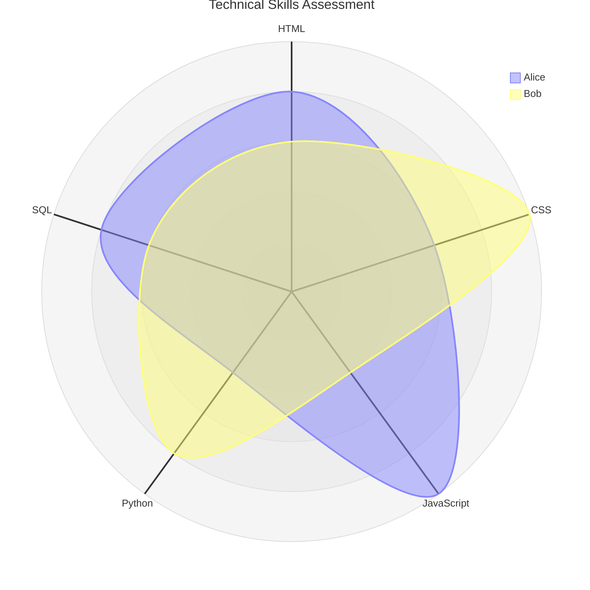
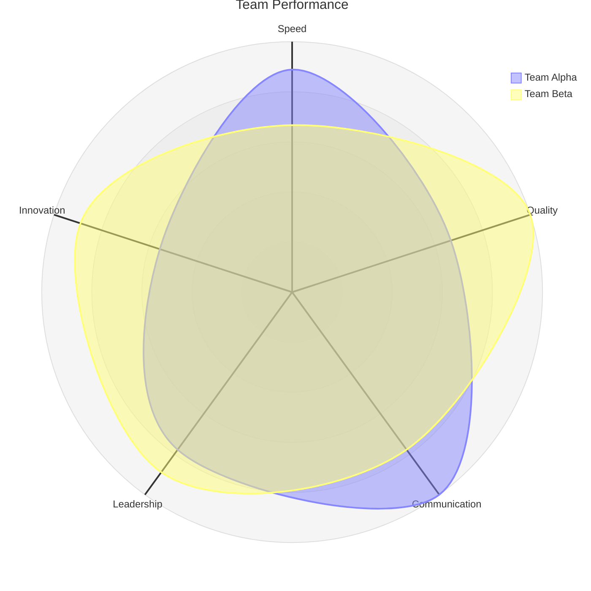

# Radar Chart Templates (Beta)

## Skills Assessment

## Team Comparison

## Key Syntax

- `radar-beta` - Declaration keyword (beta suffix required)
- `title Title Text` - Chart title
- `axis id1["Label1"], id2["Label2"], ...` - Define axes
- `curve id["Label"]{v1, v2, v3, ...}` - Data curve with sequential values
- `curve id["Label"]{ axisId: value, ... }` - Data curve with named axis values
- Config: `max`, `min`, `ticks`, `graticule` ("circle"/"polygon"), `showLegend`
