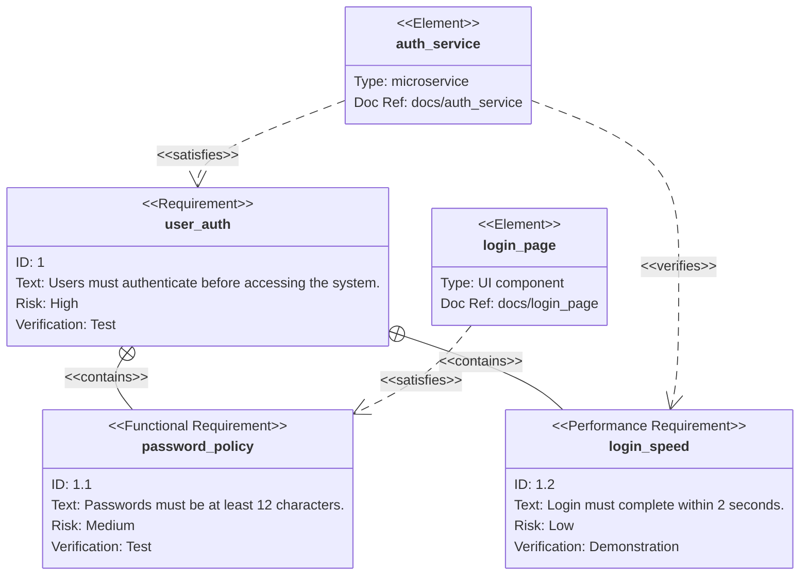

# Requirement Diagram Templates

## Basic Requirement Diagram

## Key Syntax

- `requirementDiagram` - Declaration keyword
- **Requirement types**: `requirement`, `functionalRequirement`, `interfaceRequirement`, `performanceRequirement`, `physicalRequirement`, `designConstraint`
- **Requirement fields**: `id`, `text`, `risk` (low/medium/high), `verifymethod` (analysis/inspection/test/demonstration)
- **Elements**: `element name { type: ..., docref: ... }`
- **Relationships**: `contains`, `copies`, `derives`, `satisfies`, `verifies`, `refines`, `traces`
- **Syntax**: `source - relationship -> target`
