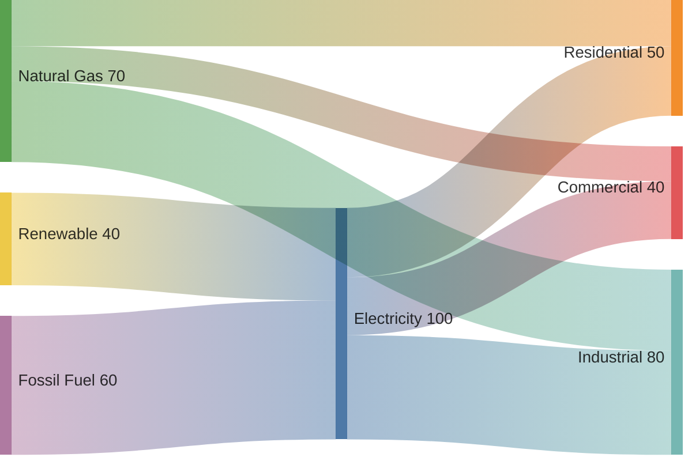
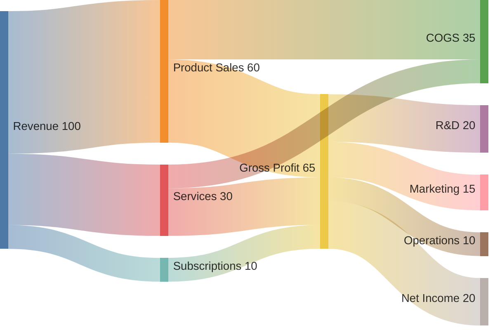

# Sankey Diagram Templates

## Basic Energy Flow

## Budget Flow

## Key Syntax

- `sankey-beta` - Declaration keyword
- CSV format: `source,target,value` (one per line)
- Empty lines allowed for spacing
- Use quoted strings for commas: `"Node, A",NodeB,100`
- Configuration options: `width`, `height`, `linkColor` ("gradient"/"source"/"target"/hex), `nodeAlignment` ("justify"/"left"/"right"/"center"), `showValues`, `prefix`, `suffix`
