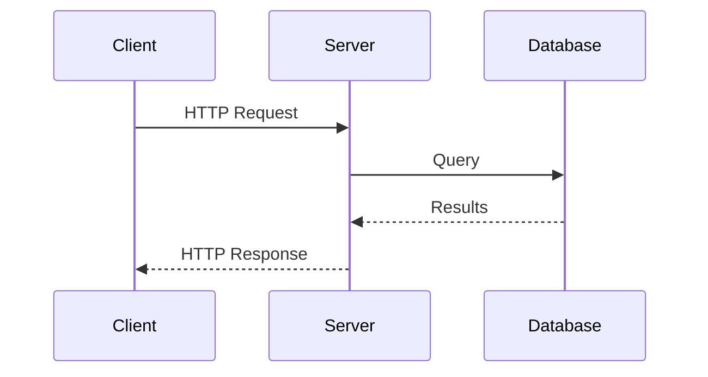
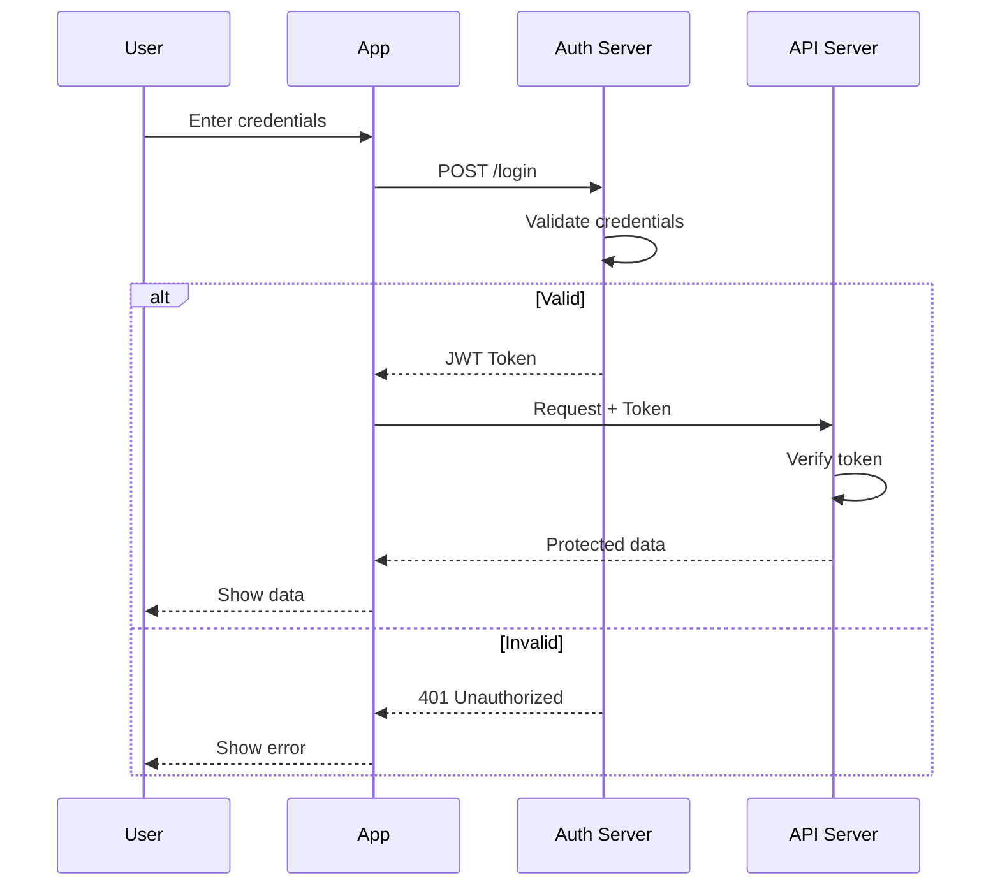
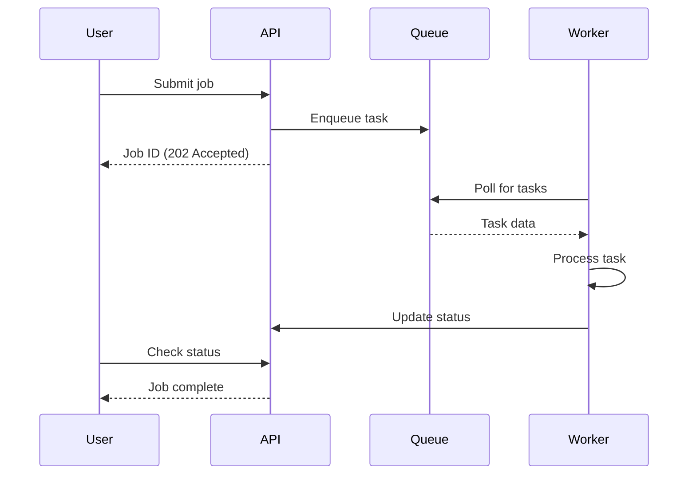

# Sequence Diagram Templates

## Basic Request-Response

## Authentication Flow

## Async Processing

## Key Syntax

- `->>` Solid line with arrowhead (synchronous)
- `-->>` Dashed line with arrowhead (response/async)
- `--)` Solid line with open arrow
- `alt/else/end` - Conditional paths
- `loop/end` - Repeated interactions
- `Note over A,B: text` - Notes spanning participants
- `activate/deactivate` - Activation bars
