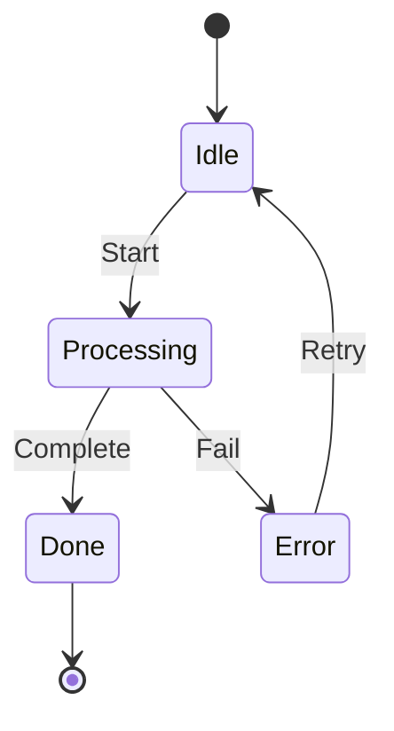
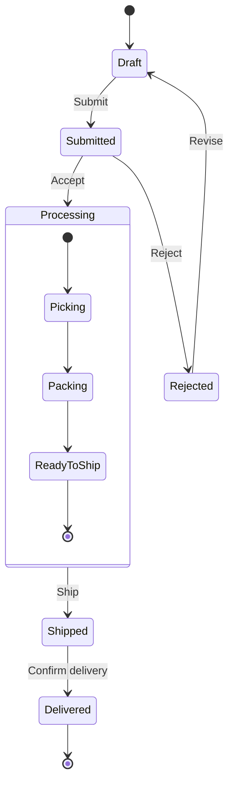
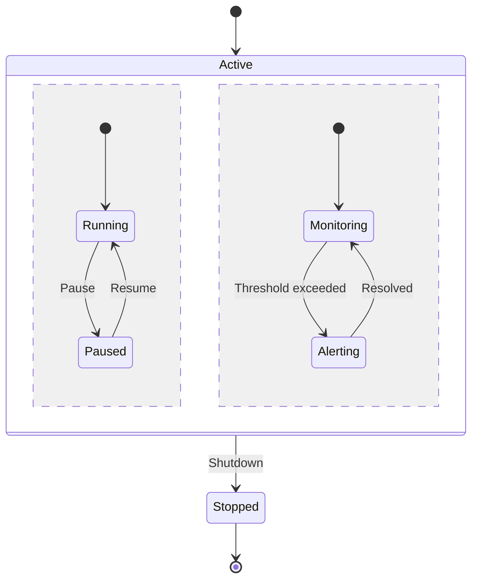

# State Diagram Templates

## Basic State Machine

## Order Lifecycle

## Concurrent States

## Key Syntax

- `[*]` Start or end state
- `-->` Transition with optional label after `:`
- `state Name { }` Composite state
- `--` Separator for concurrent regions
- `note right of State: text` Add notes
