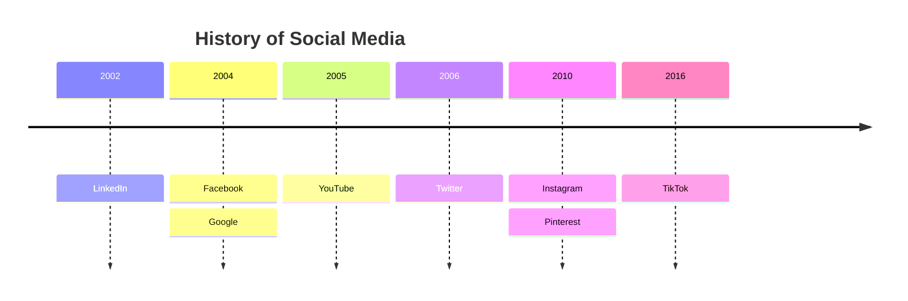
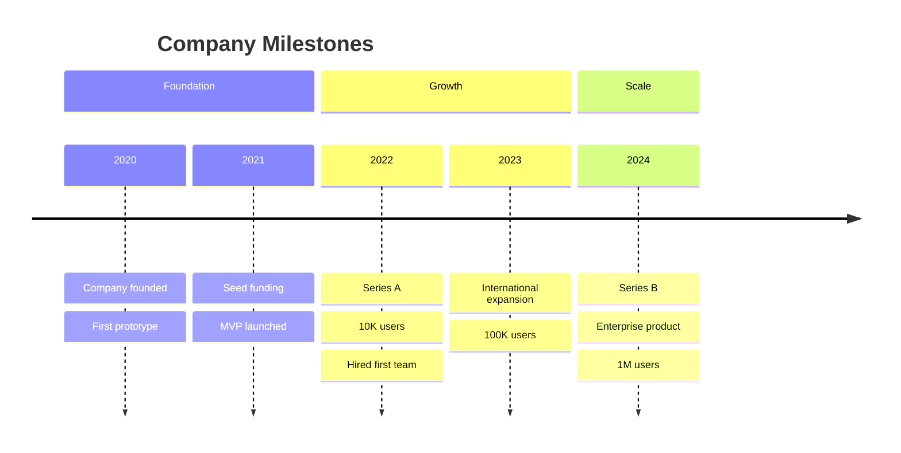

# Timeline Templates

## Basic Timeline

## Timeline with Sections

## Key Syntax

- `timeline` - Declaration keyword
- `title Title Text` - Diagram title
- `section Section Name` - Groups time periods into named sections
- `Time Period : Event` - A time period with one event
- `Time Period : Event1 : Event2` - Multiple events on one line
- Stacked events: indent with spaces and use `: Event` on next lines
