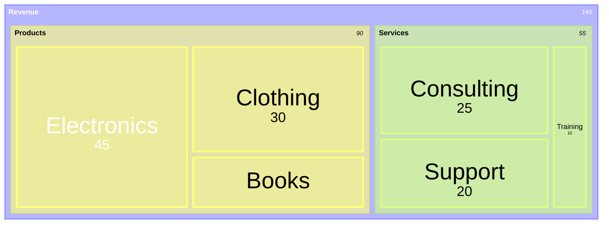
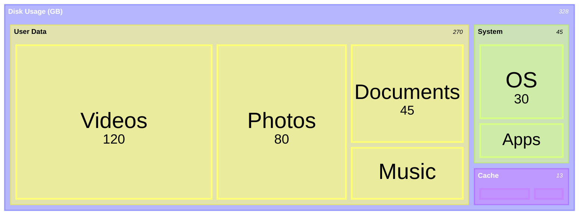

# Treemap Templates (Beta)

## Revenue Breakdown

## Disk Usage

## Key Syntax

- `treemap-beta` - Declaration keyword (beta suffix required)
- **Parent nodes**: `"Section Name"` (no value, acts as container)
- **Leaf nodes**: `"Leaf Name": numericValue`
- **Hierarchy**: Created through indentation
- Config: `showValues`, `valueFormat` (D3 format like "$,.0f"), `padding`, `labelFontSize`
