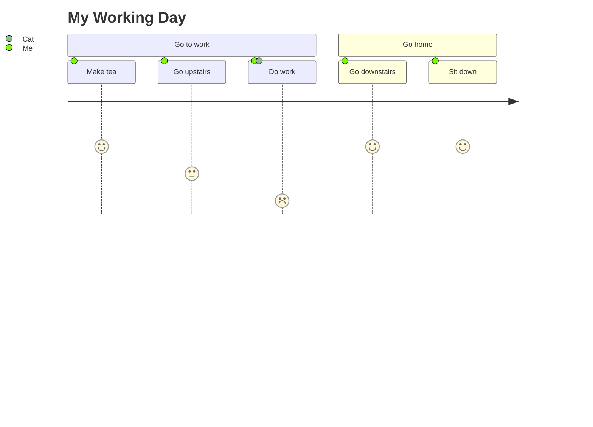
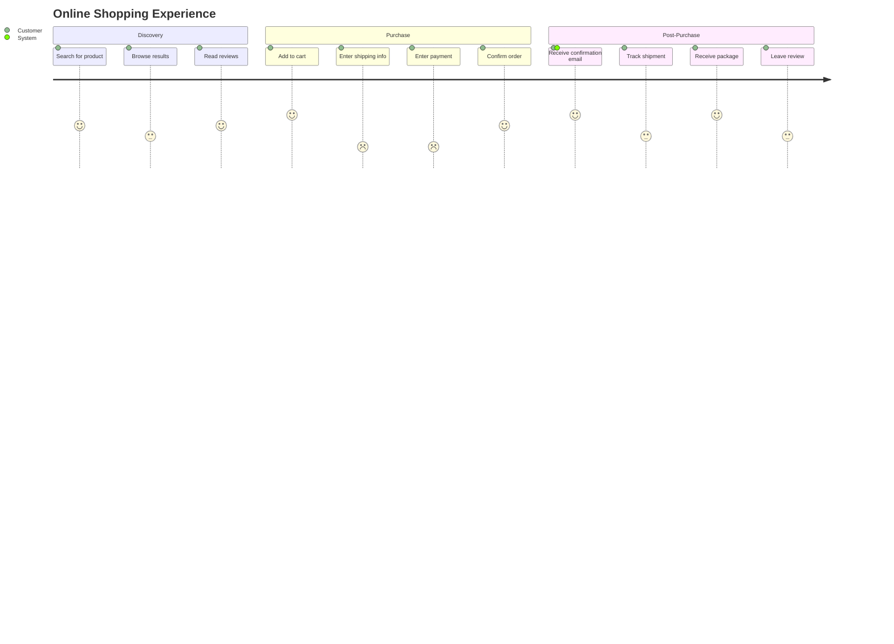

# User Journey Templates

## Basic User Journey

## E-Commerce Purchase Journey

## Key Syntax

- `journey` - Declaration keyword
- `title Title Text` - Diagram title
- `section Section Name` - Groups tasks into phases
- `Task name: score: actor1, actor2` - Task with satisfaction score (1-5) and actors
- Score: 1 = worst (red), 5 = best (green)
- Multiple actors are comma-separated
