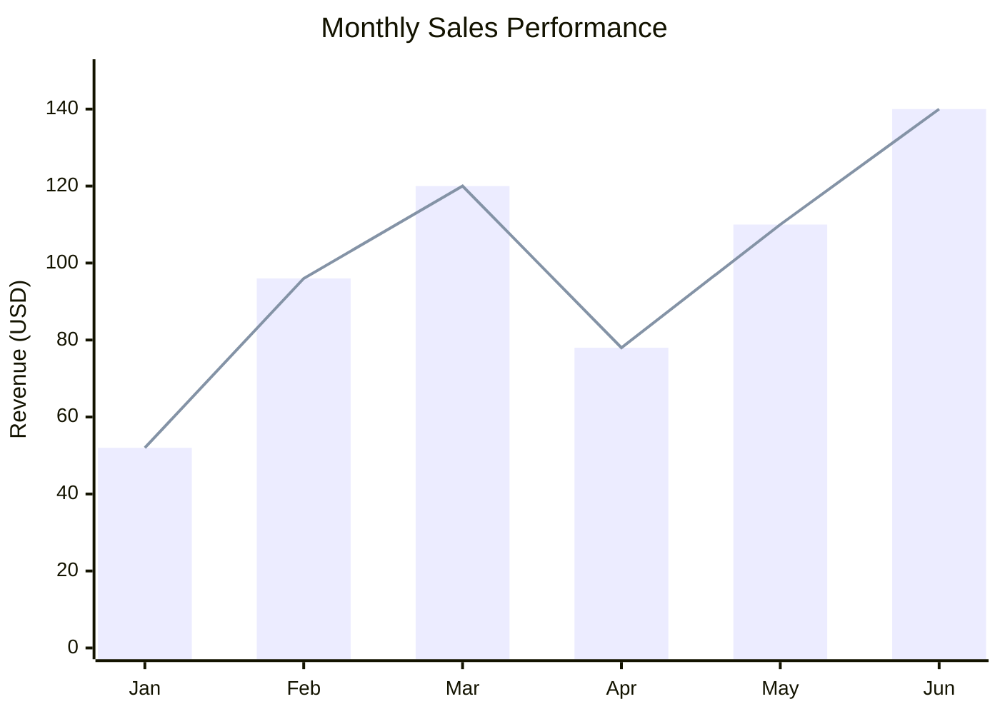
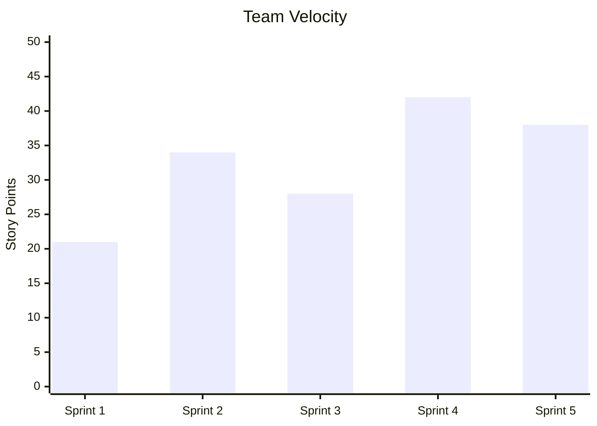
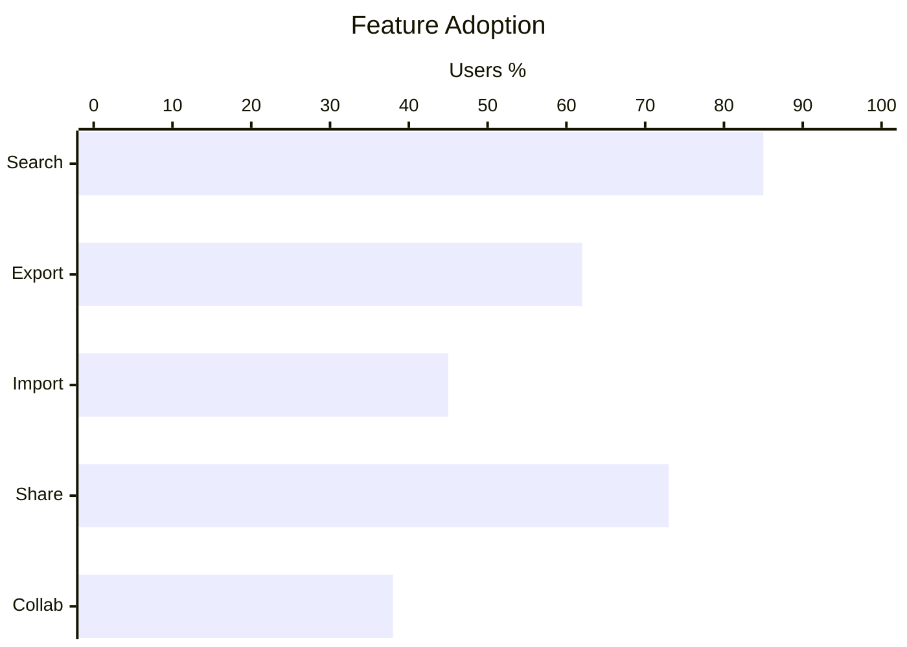

# XY Chart Templates

## Bar and Line Chart

## Bar Chart Only

## Horizontal Chart

## Key Syntax

- `xychart-beta` - Declaration keyword (add `horizontal` for horizontal orientation)
- `title "Chart Title"` - Title (**ALWAYS use double quotes**)
- `x-axis ["cat1", "cat2", ...]` - Categorical x-axis (**ALWAYS quote each label**)
- `x-axis "Label" min --> max` - Numeric x-axis range
- `y-axis "Label" min --> max` - Numeric y-axis range
- `bar [v1, v2, ...]` - Bar series
- `line [v1, v2, ...]` - Line series
- Multiple bar/line series can be overlaid
- **IMPORTANT**: Non-ASCII characters (Chinese, etc.) in title and labels MUST be in double quotes or you will get a syntax error
