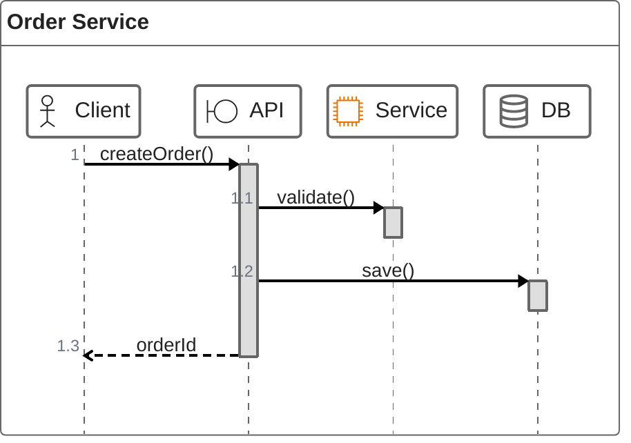
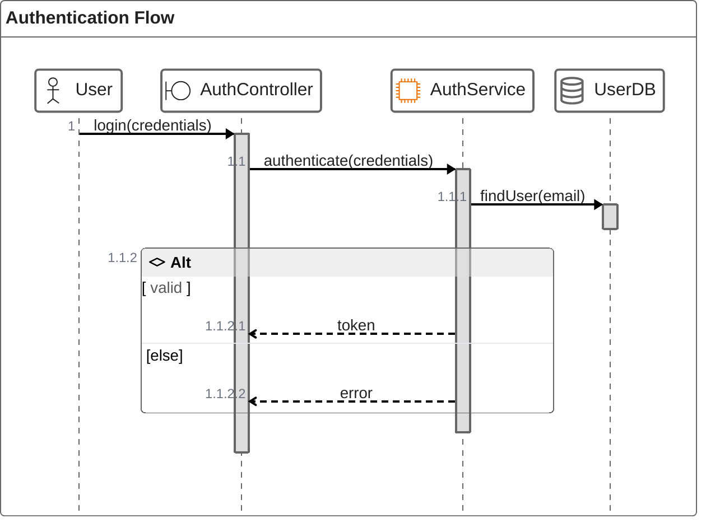
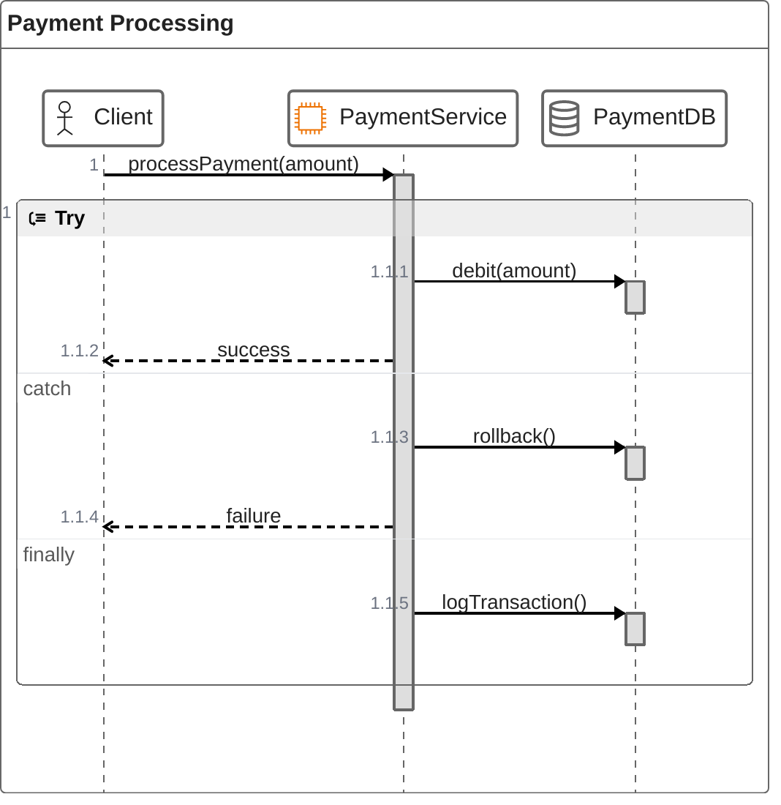

# ZenUML Templates

## Basic ZenUML Sequence

## ZenUML with Conditionals

## ZenUML with Error Handling

## Key Syntax

- `zenuml` - Declaration keyword
- **Participants**: `@Actor Name`, `@Database Name`, `@Boundary Name`, `@EC2 Name`, `@Lambda Name`
- **Sync message**: `A.method()` or `A.method() { ... }`
- **Async message**: `A->B: message`
- **Return**: `return value` inside blocks
- **Conditionals**: `if (condition) { } else { }`
- **Loops**: `while(condition) { }`, `for(item in list) { }`, `loop { }`
- **Error handling**: `try { } catch { } finally { }`
- **Parallel**: `par { ... }`
- **Comments**: `// comment text`
